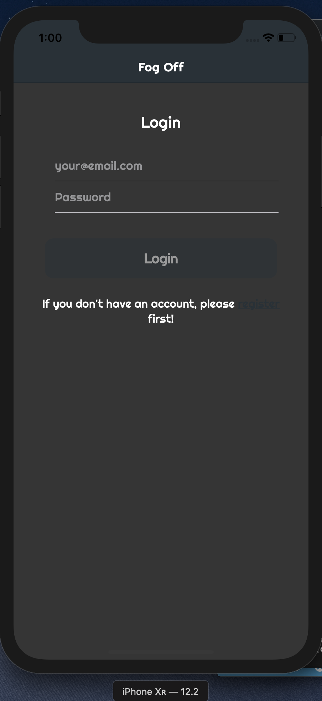
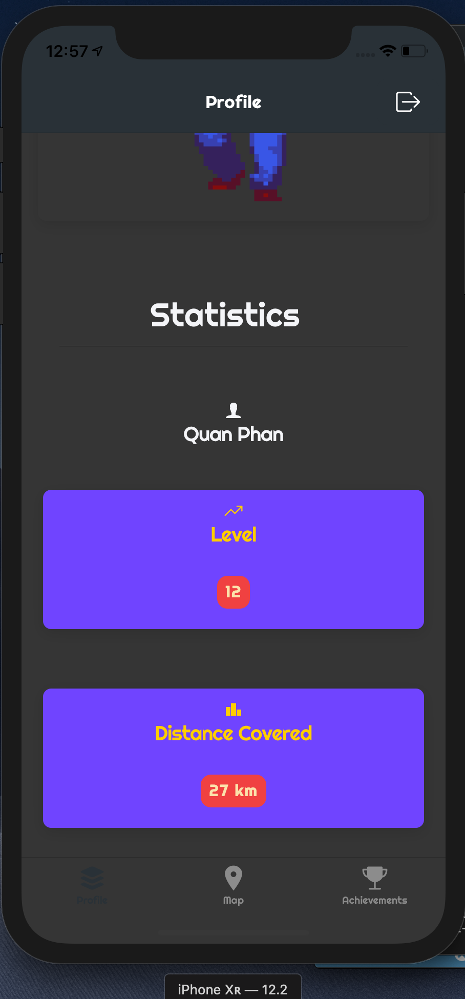
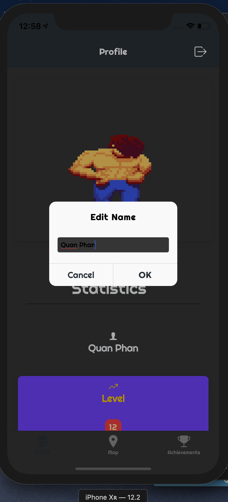

**------------------------------------------------------FOG OFF----------------------------------------------------------**

*A project application for CS 275 class in **Web App Development** with collaboration of 3 other team members in a 4-weeks time period*

*Link: https://github.com/minxmin99/CS275-Final-Project* (same source code)

***Summary***: **Fog Off** is a mobile game developed in **Ionic Framework 4** with TypeScript in **Angular 7.2** that incorporates the **Fog Of War** into real world map and scenarios with user location tracking using **GoogleMaps API.**

**Frameworks/Technologies utilized:**
- **Ionic Framework 4**
- **Angular 7.2**
- **GoogleMaps API** for Ionic (extends on **TileProvider** to create the Fog Of War function on **Google Map**)
- **SQLite** for User database management
- **NodeJS** and **Express** for Authentication/Host Server

**Testing**: 
- Tested on iPhone XR iOS 12.2 simulator and iPhone 8 iOS 12.1, Android Emulator on Android 8.0.0 SDK 28 
- Local server host

**Gantt Chart (approximately)**:https://docs.google.com/spreadsheets/d/1nT4qISeFakcFasjLV0tdjEuxMHh_RKpYyQsrmjzY_fc/edit?usp=sharing

**Some sample images**

