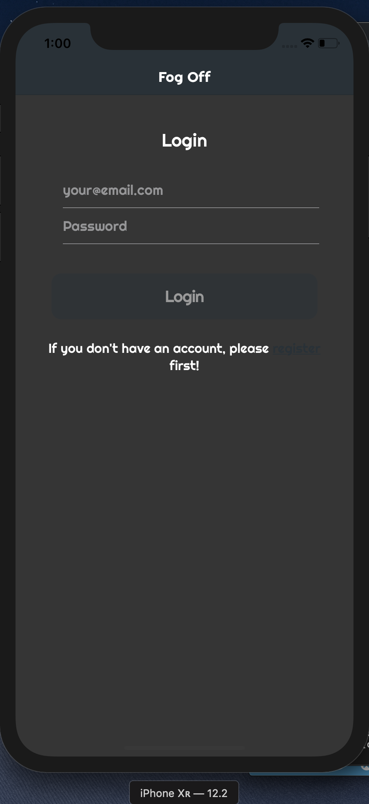
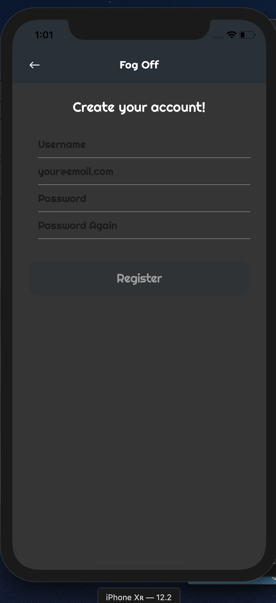
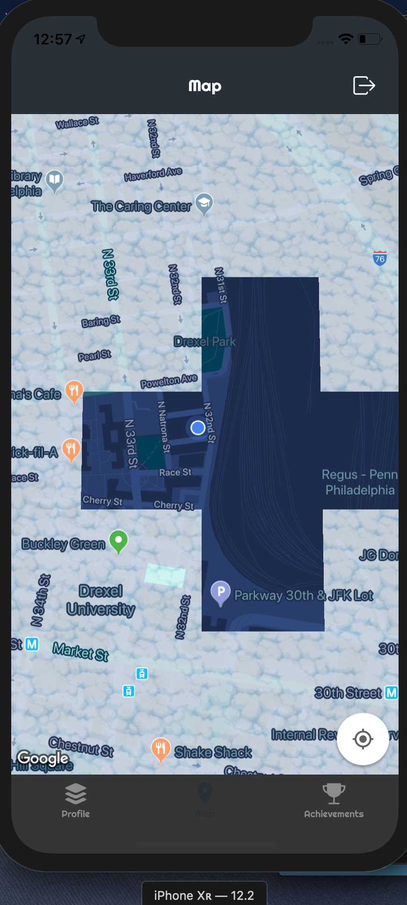
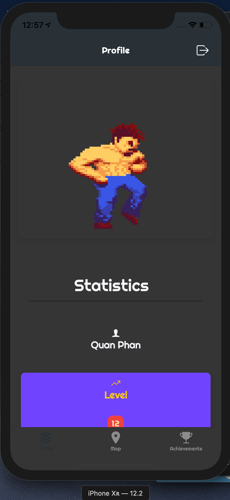
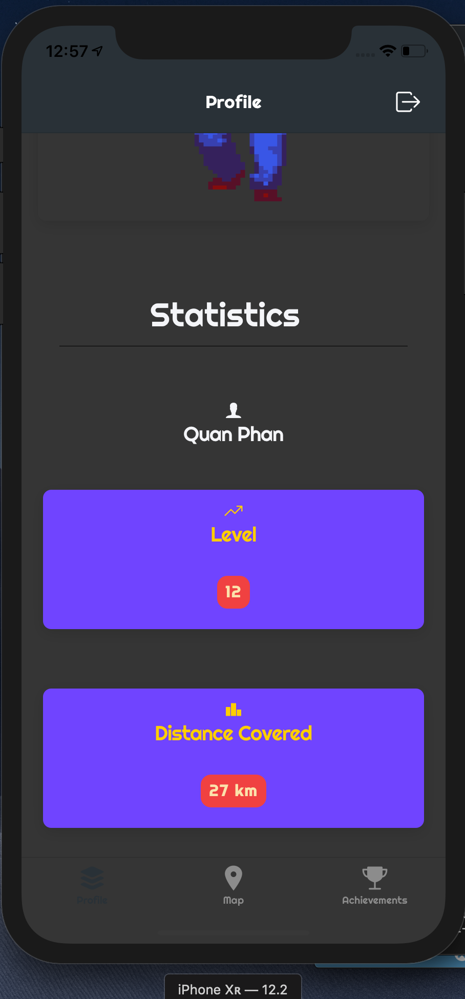
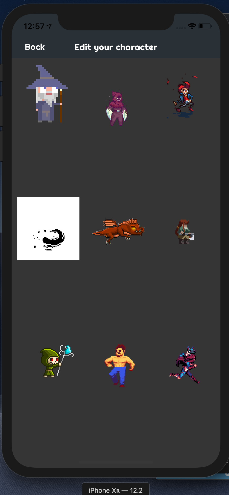
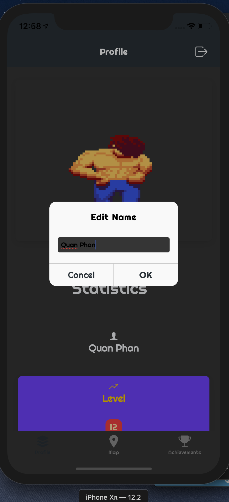

**FOG OFF**

A project application for CS 275 class in Web App Development

*Summary*: Fog Off is a mobile game developed in Ionic Framework 4 with TypeScript in Angular 7.2 that incorporates the Fog Of War into real world map and scenarios with GoogleMaps API.

